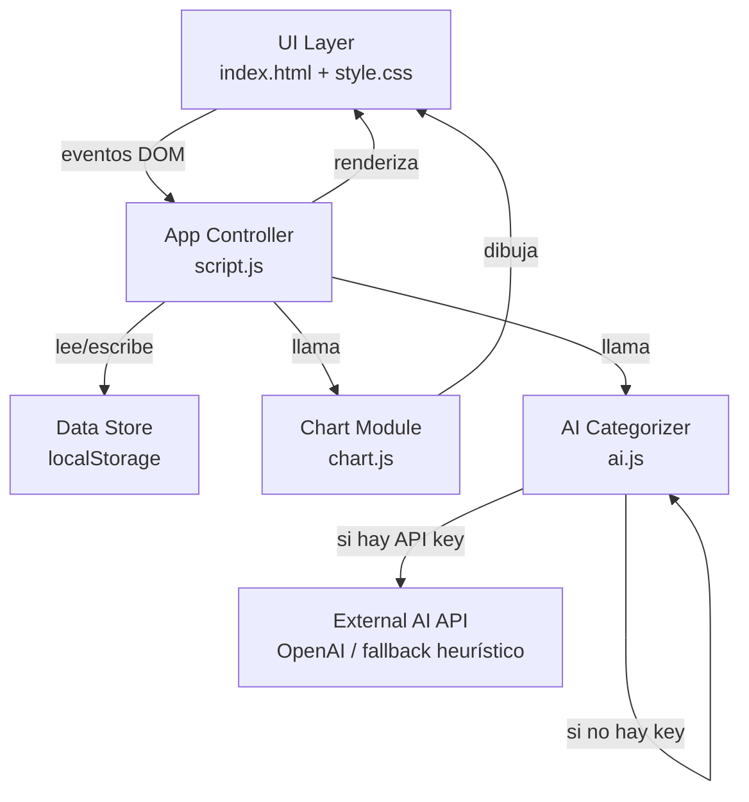
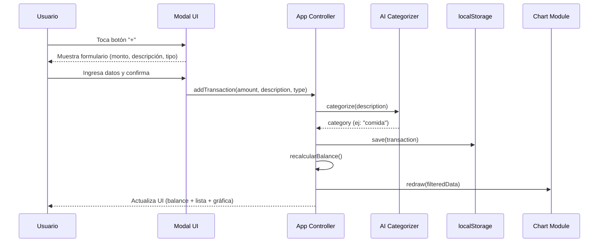
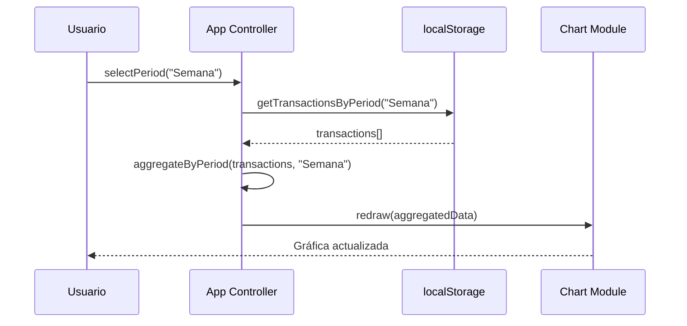

# Design Document: SplenBan — Gestor Financiero Personal

## Overview

SplenBan es una aplicación web de gestor financiero personal con diseño minimalista blanco/negro, construida en HTML, CSS y JavaScript puro (sin frameworks). Permite al usuario registrar ingresos y gastos, visualizarlos gráficamente por períodos (Día, Semana, Mes, Año), consultar transacciones recientes y aprovechar IA para categorización automática de gastos.

El diseño sigue la referencia visual proporcionada: header con saludo personalizado, balance central actualizable en tiempo real, gráfica de línea suave con selector de período, y sección de transacciones recientes en orden cronológico inverso.

La app funciona completamente en el cliente usando `localStorage` como capa de persistencia, con una capa de IA que puede operar en modo heurístico (sin API key) o conectarse a una API externa (OpenAI) cuando el usuario provea una clave.

---

## Architecture



**Módulos del proyecto:**

| Archivo | Rol |
|---|---|
| `index.html` | Estructura y layout de la UI |
| `style.css` | Estilos minimalistas blanco/negro |
| `script.js` | Controlador principal, orquestador de módulos |
| `chart.js` | Motor de gráfica de línea sobre `<canvas>` |
| `ai.js` | Categorizador automático (heurístico + API externa) |
| `store.js` | Abstracción de persistencia sobre `localStorage` |

---

## Sequence Diagrams

### Flujo: Agregar una transacción



### Flujo: Cambiar período de la gráfica



---

## Components and Interfaces

### Component 1: App Controller (`script.js`)

**Purpose**: Orquestador central. Inicializa la app, maneja eventos del DOM y coordina los demás módulos.

**Interface**:
```javascript
const App = {
  init(),                                    // Arranca la app al cargar el DOM
  addTransaction(amount, description, type), // Añade ingreso o gasto
  deleteTransaction(id),                     // Elimina una transacción por ID
  selectPeriod(period),                      // Cambia el período activo ("Día"|"Semana"|"Mes"|"Año")
  renderBalance(),                           // Actualiza el balance visible en el header
  renderTransactions(),                      // Renderiza la lista de transacciones recientes
  openModal(),                               // Abre el modal de nueva transacción
  closeModal(),                              // Cierra el modal
}
```

**Responsibilities**:
- Escuchar eventos del DOM (botones, selector de período)
- Llamar a `Store`, `AICategorzier` y `Chart` en la secuencia correcta
- Mantener el estado de UI en sincronía con los datos

---

### Component 2: Data Store (`store.js`)

**Purpose**: Abstrae el acceso a `localStorage`, provee CRUD para transacciones y preferencias de usuario.

**Interface**:
```javascript
const Store = {
  getAll(),                        // Retorna todas las transacciones
  save(transaction),               // Persiste una transacción nueva
  delete(id),                      // Elimina por ID
  getByPeriod(period, refDate),    // Filtra transacciones por período relativo a refDate
  getPreferences(),                // Lee configuración del usuario (nombre, API key)
  savePreferences(prefs),          // Guarda configuración
  clear(),                         // Borra todos los datos (reset)
}
```

**Responsibilities**:
- Serialización/deserialización JSON en `localStorage`
- Filtrado temporal de transacciones
- Aislamiento del resto del código de la API de storage

---

### Component 3: Chart Module (`chart.js`)

**Purpose**: Dibuja la gráfica de línea suave sobre un elemento `<canvas>`, con soporte para múltiples períodos.

**Interface**:
```javascript
const Chart = {
  init(canvasId),             // Asocia el módulo a un canvas del DOM
  draw(dataPoints, labels),   // Dibuja la línea con los datos y etiquetas recibidos
  setActiveLabel(index),      // Resalta el label/punto activo (pill negro)
  clear(),                    // Limpia el canvas
}
```

**Responsibilities**:
- Renderizado con Canvas 2D API (nativo del browser)
- Curvas Bézier para la línea suave
- Punto interactivo con línea vertical en el punto seleccionado
- Pills negros en el label activo del eje X
- Adaptarse a distintas densidades de datos según el período

---

### Component 4: AI Categorizer (`ai.js`)

**Purpose**: Determina la categoría de una transacción a partir de su descripción textual.

**Interface**:
```javascript
const AICategorzier = {
  async categorize(description),         // Retorna una categoría string
  setApiKey(key),                        // Configura la API key (opcional)
  getAvailableCategories(),              // Retorna lista de categorías disponibles
}
```

**Responsibilities**:
- Modo heurístico: matching de keywords por diccionario local
- Modo API: enviar descripción a OpenAI y parsear respuesta
- Fallback: si la API falla, usar heurístico
- Nunca bloquear el flujo de la app (siempre retorna una categoría)

---

### Component 5: Modal UI

**Purpose**: Formulario flotante para capturar los datos de una nueva transacción.

**Interface** (DOM-driven):
```html
<div id="modal" class="modal hidden">
  <div class="modal-content">
    <input id="modal-amount" type="number" placeholder="Monto" />
    <input id="modal-description" type="text" placeholder="Descripción" />
    <div class="type-toggle">
      <button data-type="income">Ingreso</button>
      <button data-type="expense">Gasto</button>
    </div>
    <button id="modal-confirm">Añadir</button>
    <button id="modal-cancel">Cancelar</button>
  </div>
</div>
```

---

## Data Models

### Transaction

```javascript
/**
 * @typedef {Object} Transaction
 */
const Transaction = {
  id: "string",          // UUID generado con crypto.randomUUID()
  amount: "number",      // Siempre positivo; el tipo define si suma o resta
  description: "string", // Texto libre del usuario
  category: "string",    // Asignada por AICategorzier
  type: "string",        // "income" | "expense"
  date: "string",        // ISO 8601: "2025-06-15T10:30:00.000Z"
}
```

**Validation Rules**:
- `amount` debe ser > 0
- `type` debe ser exactamente `"income"` o `"expense"`
- `description` puede ser vacío (categoría se asigna como "Sin categoría")
- `date` se genera automáticamente al momento de creación (no editable por usuario)

---

### UserPreferences

```javascript
/**
 * @typedef {Object} UserPreferences
 */
const UserPreferences = {
  userName: "string",    // Nombre visible en el header (ej: "Justin")
  apiKey: "string",      // API key de OpenAI (opcional, puede ser "")
  currency: "string",    // Símbolo de moneda (ej: "$", "€")
  theme: "string",       // "light" | "dark" (por ahora siempre "light")
}
```

---

### ChartDataPoint

```javascript
/**
 * @typedef {Object} ChartDataPoint
 */
const ChartDataPoint = {
  label: "string",  // Etiqueta del eje X (ej: "Junio", "Lun", "Sem 3")
  value: "number",  // Suma neta de transacciones en ese intervalo
  isActive: "boolean", // true si es el punto/período actualmente seleccionado
}
```

---

## Algorithmic Pseudocode

### Algoritmo Principal: `addTransaction`

```javascript
async function addTransaction(amount, description, type) {
  // Preconditions:
  //   amount > 0
  //   type === "income" || type === "expense"

  const category = await AICategorzier.categorize(description)

  const transaction = {
    id: crypto.randomUUID(),
    amount: parseFloat(amount),
    description: description.trim(),
    category,
    type,
    date: new Date().toISOString()
  }

  Store.save(transaction)

  App.renderBalance()
  App.renderTransactions()

  const aggregated = aggregateByPeriod(Store.getAll(), App.currentPeriod)
  Chart.draw(aggregated.dataPoints, aggregated.labels)

  // Postconditions:
  //   transaction está en Store.getAll()
  //   balance refleja la nueva transacción
  //   gráfica muestra el nuevo punto
}
```

---

### Algoritmo: `aggregateByPeriod`

```javascript
function aggregateByPeriod(transactions, period) {
  // Preconditions:
  //   transactions es un array (puede estar vacío)
  //   period es uno de: "Día", "Semana", "Mes", "Año"

  const now = new Date()
  let buckets = []       // Array de { label, start, end }
  let dataPoints = []    // Array de ChartDataPoint

  // Paso 1: Definir los buckets según el período
  if (period === "Día") {
    // 24 horas del día actual, una por hora (o agrupadas de 4h)
    buckets = generateHourlyBuckets(now)
  } else if (period === "Semana") {
    // 7 días de la semana actual (Lun–Dom)
    buckets = generateDailyBuckets(now)
  } else if (period === "Mes") {
    // Los últimos 5–6 meses, con el mes actual activo
    buckets = generateMonthlyBuckets(now, 5)
  } else if (period === "Año") {
    // Los últimos 5 años
    buckets = generateYearlyBuckets(now, 5)
  }

  // Paso 2: Sumar transacciones en cada bucket
  // Loop Invariant: para todo bucket ya procesado, dataPoints[i].value
  //   es la suma neta correcta de las transacciones en ese rango.
  for (const bucket of buckets) {
    let net = 0
    for (const tx of transactions) {
      const txDate = new Date(tx.date)
      if (txDate >= bucket.start && txDate < bucket.end) {
        net += tx.type === "income" ? tx.amount : -tx.amount
      }
    }
    dataPoints.push({
      label: bucket.label,
      value: net,
      isActive: bucket.containsDate(now)
    })
  }

  // Postconditions:
  //   dataPoints.length === buckets.length
  //   exactamente un dataPoints[i].isActive === true
  return { dataPoints, labels: buckets.map(b => b.label) }
}
```

---

### Algoritmo: Dibujado de la gráfica (Canvas 2D)

```javascript
function drawChart(canvas, dataPoints) {
  // Preconditions:
  //   canvas es un HTMLCanvasElement válido
  //   dataPoints.length >= 2

  const ctx = canvas.getContext("2d")
  const W = canvas.width
  const H = canvas.height
  const PAD = { top: 20, right: 20, bottom: 40, left: 20 }

  const values = dataPoints.map(p => p.value)
  const minV = Math.min(...values, 0)
  const maxV = Math.max(...values, 0)
  const range = maxV - minV || 1  // evitar división por cero

  // Función auxiliar: mapear valor a coordenada Y
  const toY = (v) => PAD.top + (1 - (v - minV) / range) * (H - PAD.top - PAD.bottom)
  const toX = (i) => PAD.left + (i / (dataPoints.length - 1)) * (W - PAD.left - PAD.right)

  ctx.clearRect(0, 0, W, H)

  // Paso 1: Dibujar línea suave con curvas Bézier
  ctx.beginPath()
  ctx.strokeStyle = "#000000"
  ctx.lineWidth = 3
  ctx.lineJoin = "round"
  ctx.lineCap = "round"

  ctx.moveTo(toX(0), toY(values[0]))

  // Loop Invariant: todos los segmentos [0..i-1] ya están trazados
  for (let i = 1; i < dataPoints.length; i++) {
    const cpX = (toX(i - 1) + toX(i)) / 2
    ctx.bezierCurveTo(
      cpX, toY(values[i - 1]),
      cpX, toY(values[i]),
      toX(i), toY(values[i])
    )
  }
  ctx.stroke()

  // Paso 2: Resaltar punto activo
  const activeIdx = dataPoints.findIndex(p => p.isActive)
  if (activeIdx >= 0) {
    const ax = toX(activeIdx)
    const ay = toY(values[activeIdx])

    // Línea vertical punteada
    ctx.beginPath()
    ctx.setLineDash([4, 4])
    ctx.strokeStyle = "#555"
    ctx.lineWidth = 1
    ctx.moveTo(ax, PAD.top)
    ctx.lineTo(ax, H - PAD.bottom)
    ctx.stroke()
    ctx.setLineDash([])

    // Punto negro
    ctx.beginPath()
    ctx.fillStyle = "#000"
    ctx.arc(ax, ay, 6, 0, Math.PI * 2)
    ctx.fill()

    // Halo blanco
    ctx.beginPath()
    ctx.strokeStyle = "#fff"
    ctx.lineWidth = 2
    ctx.arc(ax, ay, 6, 0, Math.PI * 2)
    ctx.stroke()
  }

  // Paso 3: Dibujar labels del eje X
  ctx.fillStyle = "#000"
  ctx.font = "12px system-ui"
  ctx.textAlign = "center"

  for (let i = 0; i < dataPoints.length; i++) {
    const x = toX(i)
    const y = H - 8
    if (dataPoints[i].isActive) {
      // Pill negro para el label activo
      const tw = ctx.measureText(dataPoints[i].label).width + 16
      ctx.fillStyle = "#000"
      ctx.beginPath()
      ctx.roundRect(x - tw / 2, y - 16, tw, 22, 11)
      ctx.fill()
      ctx.fillStyle = "#fff"
    } else {
      ctx.fillStyle = "#000"
    }
    ctx.fillText(dataPoints[i].label, x, y)
  }

  // Postconditions:
  //   canvas muestra línea suave, punto activo resaltado y labels con pill
}
```

---

### Algoritmo: AI Categorizer (heurístico)

```javascript
const CATEGORY_KEYWORDS = {
  "comida":          ["restaurante", "comida", "almuerzo", "cena", "desayuno", "pizza", "sushi", "super", "mercado", "grocery"],
  "transporte":      ["uber", "taxi", "bus", "metro", "gasolina", "combustible", "peaje", "parking"],
  "entretenimiento": ["cine", "netflix", "spotify", "juego", "concierto", "teatro", "streaming"],
  "salud":           ["farmacia", "médico", "doctor", "clínica", "hospital", "medicamento"],
  "ropa":            ["ropa", "zapatos", "tienda", "zara", "h&m", "nike", "adidas"],
  "hogar":           ["renta", "alquiler", "luz", "agua", "internet", "teléfono", "servicios"],
  "educación":       ["libro", "curso", "universidad", "colegio", "taller", "clase"],
  "ingreso":         ["salario", "sueldo", "nómina", "freelance", "pago", "cobro", "transferencia"],
}

async function categorize(description) {
  // Preconditions:
  //   description es un string (puede estar vacío)

  const lower = description.toLowerCase().trim()

  if (lower === "") return "Sin categoría"

  // Modo API (si hay API key)
  if (apiKey) {
    try {
      const result = await callOpenAI(lower)
      if (result) return result
    } catch (e) {
      console.warn("AI API falló, usando heurístico:", e)
    }
  }

  // Modo heurístico: buscar keyword en descripción
  for (const [category, keywords] of Object.entries(CATEGORY_KEYWORDS)) {
    for (const kw of keywords) {
      if (lower.includes(kw)) return category
    }
  }

  // Fallback
  return "Otros"

  // Postconditions:
  //   retorna siempre un string no vacío
  //   nunca lanza excepción hacia el caller
}
```

---

### Algoritmo: `renderBalance`

```javascript
function renderBalance() {
  const transactions = Store.getAll()

  // Loop Invariant: balance acumula correctamente todos los tx procesados hasta i-1
  let balance = 0
  for (const tx of transactions) {
    balance += tx.type === "income" ? tx.amount : -tx.amount
  }

  const formatted = formatCurrency(balance)  // ej: "$1,234.56"
  document.getElementById("balance-amount").textContent = formatted

  // Color: rojo si negativo, negro si positivo/cero
  const el = document.getElementById("balance-amount")
  el.style.color = balance < 0 ? "#c0392b" : "#000000"

  // Postconditions:
  //   DOM muestra el balance actualizado
  //   color refleja si es positivo o negativo
}
```

---

## Key Functions with Formal Specifications

### `Store.getByPeriod(period, refDate)`

```javascript
function getByPeriod(period, refDate = new Date())
```

**Preconditions:**
- `period` ∈ `{"Día", "Semana", "Mes", "Año"}`
- `refDate` es una fecha válida

**Postconditions:**
- Retorna un array de `Transaction[]`
- Cada transacción en el resultado tiene `date` dentro del rango del período relativo a `refDate`
- No modifica `localStorage`

**Loop Invariants:**
- Cada iteración solo incluye transacciones cuya fecha cae en el rango calculado

---

### `Chart.draw(dataPoints, labels)`

```javascript
function draw(dataPoints, labels)
```

**Preconditions:**
- `dataPoints.length >= 2` para que la línea sea visible
- `labels.length === dataPoints.length`
- Exactamente un `dataPoints[i].isActive === true`

**Postconditions:**
- Canvas renderiza línea suave, punto activo con pill, labels en eje X
- Estado visual del canvas es completamente determinista dado los mismos inputs

---

### `AICategorzier.categorize(description)`

```javascript
async function categorize(description): Promise<string>
```

**Preconditions:**
- `description` es un string (incluyendo vacío)

**Postconditions:**
- Siempre retorna un string no vacío
- Nunca lanza excepción hacia el caller
- Si `description` es vacío → retorna `"Sin categoría"`
- Si encuentra keyword → retorna la categoría correspondiente
- Si nada coincide → retorna `"Otros"`

---

## Example Usage

```javascript
// --- Inicializar la app ---
document.addEventListener("DOMContentLoaded", () => {
  App.init()
})

// --- Agregar un gasto ---
await App.addTransaction(150.00, "Almuerzo en restaurante", "expense")
// AI detecta "restaurante" → categoría: "comida"
// Balance: -$150.00

// --- Agregar un ingreso ---
await App.addTransaction(2500.00, "Pago de nómina", "income")
// AI detecta "nómina" → categoría: "ingreso"
// Balance: +$2,350.00

// --- Cambiar período ---
App.selectPeriod("Semana")
// Gráfica se actualiza mostrando los 7 días de la semana actual

// --- Obtener transacciones recientes (últimas 5) ---
const recent = Store.getAll()
  .sort((a, b) => new Date(b.date) - new Date(a.date))
  .slice(0, 20)
// Lista ordenada, la más reciente primero

// --- Categorización manual vía heurístico ---
const cat1 = await AICategorzier.categorize("pizza familiar")      // → "comida"
const cat2 = await AICategorzier.categorize("Uber al aeropuerto")  // → "transporte"
const cat3 = await AICategorzier.categorize("Netflix mensual")     // → "entretenimiento"
const cat4 = await AICategorzier.categorize("regalo cumpleaños")   // → "Otros"
```

---

## Correctness Properties

*Una propiedad es una característica o comportamiento que debe mantenerse verdadero en todas las ejecuciones válidas del sistema — esencialmente, un enunciado formal sobre lo que el sistema debe hacer. Las propiedades sirven como puente entre las especificaciones legibles por humanos y las garantías de corrección verificables por máquinas.*

### Property 1: Consistencia del balance

*Para todo* conjunto de transacciones almacenadas en el Store, el balance calculado por `renderBalance()` debe ser exactamente igual a la suma de todos los `amount` con `type === "income"` menos la suma de todos los `amount` con `type === "expense"`.

**Validates: Requirements 4.1, 4.2**

---

### Property 2: Sincronía de UI tras mutación

*Para todo* estado del Store y toda operación de mutación (agregar o eliminar una transacción), tras completar la operación, los elementos del DOM `#balance-amount`, la lista de transacciones y el canvas de la gráfica deben reflejar consistentemente el nuevo estado del Store dentro del mismo ciclo de render.

**Validates: Requirements 2.6, 3.3, 4.5, 9.3**

---

### Property 3: Indicador de color del balance

*Para todo* conjunto de transacciones, el color del elemento `#balance-amount` debe ser `#c0392b` cuando el balance calculado es negativo y `#000000` cuando es mayor o igual a cero.

**Validates: Requirements 4.3, 4.4**

---

### Property 4: Round-trip de persistencia del Store

*Para todo* objeto `Transaction` válido (con `amount > 0`, `type` en `{"income","expense"}`, `id` UUID, `date` ISO 8601), invocar `Store.save(transaction)` seguido de `Store.getAll()` debe retornar un array que contiene una transacción con los mismos valores de `id`, `amount`, `type`, `description` y `date`.

**Validates: Requirements 6.1, 6.2, 6.4**

---

### Property 5: Eliminación quirúrgica del Store

*Para todo* conjunto de transacciones en el Store y todo `id` perteneciente al conjunto, invocar `Store.delete(id)` debe dejar en el Store exactamente las transacciones que tenían un `id` diferente — ni más ni menos.

**Validates: Requirements 3.2, 6.3**

---

### Property 6: Invariantes del agregador de períodos

*Para todo* conjunto de transacciones (incluyendo el vacío) y todo `period` ∈ `{"Día","Semana","Mes","Año"}`, `aggregateByPeriod(transactions, period)` debe satisfacer simultáneamente: (a) la longitud de `dataPoints` es exactamente el número de buckets esperado para ese período, (b) exactamente un `dataPoints[i].isActive === true`, (c) los intervalos `[start, end)` de los buckets son contiguos y sin solapamiento, y (d) la suma de `dataPoints[i].value` sobre todos los buckets es igual a `sum(income) - sum(expense)` de las transacciones que caen en el rango total cubierto.

**Validates: Requirements 5.2, 5.6, 5.7**

---

### Property 7: Categorización correcta por keywords

*Para todo* string de descripción que contenga al menos un keyword del diccionario de `AICategorzier`, `categorize(description)` debe retornar la categoría asociada al primer keyword encontrado; y *para todo* string que no contenga ningún keyword, debe retornar `"Otros"`.

**Validates: Requirements 7.2, 7.3**

---

### Property 8: Robustez del categorizador

*Para todo* string de descripción (incluyendo vacío, solo espacios, caracteres especiales, textos muy largos y cualquier input inesperado), `AICategorzier.categorize(description)` debe siempre resolver la promesa con un string no vacío y nunca rechazar ni propagar una excepción hacia el caller.

**Validates: Requirements 7.4, 7.7**

---

### Property 9: Inmutabilidad de transacciones persistidas

*Para todo* intento de modificar los campos `amount`, `type` o `date` de una transacción que ya existe en el Store, el Store debe permanecer sin cambios — el único efecto permitido sobre una transacción existente es su eliminación.

**Validates: Requirements 10.5**

---

### Property 10: Unicidad de IDs de transacciones

*Para todo* conjunto de N transacciones creadas mediante `addTransaction`, todos los `id` generados deben ser distintos entre sí.

**Validates: Requirements 10.3**

---

### Property 11: Validación de monto antes de persistir

*Para todo* valor de monto que sea cero, negativo, `NaN` o no parseable como número positivo, invocar el flujo de agregar transacción debe dejar el Store exactamente igual que antes de la invocación — sin ninguna transacción nueva guardada.

**Validates: Requirements 2.3, 10.2**

---

### Property 12: Inicialización con datos existentes

*Para todo* conjunto de transacciones previamente guardadas en `localStorage` y *para todo* conjunto de preferencias de usuario, al ejecutar `App.init()`, el DOM debe mostrar el balance correcto, la lista de transacciones en orden cronológico inverso y las preferencias del usuario visibles en el header.

**Validates: Requirements 1.2, 1.4**

---

### Property 13: Orden cronológico inverso de la lista

*Para todo* conjunto de transacciones con fechas distintas, la lista renderizada por `renderTransactions()` debe presentar las transacciones en orden tal que para todo par de posiciones `i < j` en la lista, la fecha de la transacción en posición `i` sea mayor o igual a la fecha de la transacción en posición `j`.

**Validates: Requirements 9.1**

---

### Property 14: Completitud del renderizado de transacciones

*Para toda* transacción en el Store, su representación en el DOM generada por `renderTransactions()` debe incluir el monto formateado, la descripción, la categoría, el tipo y la fecha.

**Validates: Requirements 9.2**

---

### Property 15: Consistencia del símbolo de moneda

*Para todo* símbolo de moneda configurado en `UserPreferences`, todas las representaciones numéricas de balance y montos mostradas en el DOM deben incluir ese símbolo.

**Validates: Requirements 8.4**

---

## Error Handling

### Error Scenario 1: Monto inválido en el modal

**Condition**: El usuario ingresa un monto vacío, cero o negativo.
**Response**: Mostrar mensaje de validación inline en el modal ("Ingresa un monto válido mayor a 0"). No cerrar el modal ni llamar a `addTransaction`.
**Recovery**: El usuario corrige el valor y reintenta.

---

### Error Scenario 2: API key de IA inválida o sin conexión

**Condition**: `callOpenAI()` retorna error HTTP (401, 429, 503) o timeout.
**Response**: Log de `console.warn`. La función `categorize` hace fallback silencioso al heurístico local.
**Recovery**: Automático — la categorización continúa sin interrupción para el usuario.

---

### Error Scenario 3: `localStorage` lleno o no disponible

**Condition**: `localStorage.setItem()` lanza `QuotaExceededError` o `SecurityError`.
**Response**: Capturar la excepción en `Store.save()`. Mostrar notificación toast: "No se pudo guardar la transacción. Almacenamiento lleno."
**Recovery**: El usuario puede borrar transacciones antiguas desde configuración.

---

### Error Scenario 4: Canvas no disponible

**Condition**: El browser no soporta Canvas 2D API (muy raro, pero posible en entornos de prueba).
**Response**: `Chart.init()` detecta `!canvas.getContext` y muestra un mensaje alternativo: "Tu navegador no soporta gráficas."
**Recovery**: La app funciona sin gráfica; balance y transacciones siguen operativos.

---

## Testing Strategy

### Unit Testing Approach

- `aggregateByPeriod()`: Verificar que los buckets se generan correctamente para cada período y que la suma neta es exacta.
- `Store.getByPeriod()`: Testear filtrado con transacciones en el límite exacto de los rangos (boundary testing).
- `AICategorzier.categorize()`: Testear cada categoría con sus keywords, string vacío, texto sin match, y fallo de API.
- `renderBalance()`: Mock de `Store.getAll()` con conjuntos mixtos de ingresos y gastos; verificar cálculo correcto.

### Property-Based Testing Approach

**Property Test Library**: fast-check (si se añade entorno de tests) o validaciones manuales en desarrollo.

**Properties a verificar:**
- `∀ transactions[]: balance(transactions) === income_sum - expense_sum`
- `∀ period: aggregateByPeriod([], period).dataPoints.every(p => p.value === 0)`
- `∀ description: categorize(description)` siempre retorna string no vacío
- `∀ dataPoints con length >= 2: Chart.draw() no lanza excepción`

### Integration Testing Approach

- Flujo completo: agregar transacción → verificar que aparece en la lista, balance actualizado y gráfica redibujada.
- Persistencia: recargar la página → verificar que todas las transacciones se recuperan de `localStorage`.
- Cambio de período: verificar que la gráfica y los datos se filtran correctamente al cambiar entre Día/Semana/Mes/Año.

---

## Performance Considerations

- **Canvas rendering**: La gráfica se redibuja completamente en cada cambio. Con `<= 365 puntos` (modo Año diario) esto es imperceptible. Si se escala a miles de puntos, se puede agregar debounce en el resize.
- **localStorage reads**: Las operaciones de `Store.getAll()` deserializan JSON completo cada vez. Con volumen moderado (< 10,000 transacciones) esto es < 1ms. Si escala, se puede implementar un cache en memoria.
- **AI API latency**: La llamada a OpenAI puede tardar 500ms–2s. El modal puede mostrar un spinner mientras espera `categorize()`, y la UI no debe bloquearse (uso correcto de `async/await`).

---

## Security Considerations

- **API Key storage**: La clave de OpenAI se guarda en `localStorage`. No se transmite a ningún servidor propio. El usuario debe ser informado de que es una clave del lado cliente y debe proteger su dispositivo.
- **Input sanitization**: Las descripciones de transacciones se insertan en el DOM usando `textContent` (nunca `innerHTML`) para prevenir XSS.
- **Amount validation**: El monto siempre se parsea con `parseFloat()` y se valida `> 0` antes de guardarse; no se evalúa como expresión.
- **localStorage isolation**: Los datos son locales al origen (`localhost` o el dominio desplegado). No hay riesgo de acceso cross-origin.

---

## Dependencies

| Dependencia | Tipo | Propósito |
|---|---|---|
| Ningún framework JS | — | App en vanilla JS puro |
| Canvas 2D API | Browser nativa | Gráfica de línea |
| `crypto.randomUUID()` | Browser nativa | Generación de IDs únicos |
| `localStorage` | Browser nativa | Persistencia de datos |
| OpenAI API (opcional) | Externa / REST | Categorización con IA avanzada |
| `fetch()` | Browser nativa | Llamadas HTTP a la API de IA |
| `Intl.NumberFormat` | Browser nativa | Formateo de moneda localizado |
